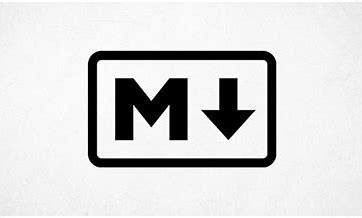

# Markdown
## ¿Qué es Markdown y por qué usarlo en la documentación de nuestros proyectos?

Markdown es un lenguaje de marcado que facilita la aplicación de formato a un texto empleando una serie de caracteres de una forma especial. En principio, fue pensado para elaborar textos cuyo destino iba a ser la web con más rapidez y sencillez que si estuviésemos empleando directamente HTML. 

### Enlaces

- [Markdown](https://ciberninjas.com/markdown/)
- [Enlace a otro fichero fichero Markdown](prueba.md)

### Imagen
